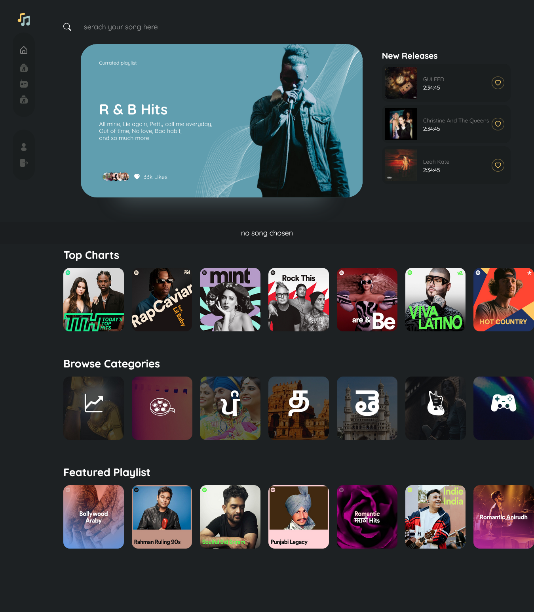
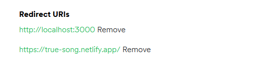

- [Overview](#overview)
  - [The challenge](#the-challenge)
  - [Screenshot](#screenshot)
  - [Links](#links)
- [My process](#my-process)
  - [Built with](#built-with)
- [Setp on local](#setup)
- [Author](#author)

## Overview

### The challenge

Create A music App Close to [Figma Design](https://www.figma.com/file/pbwKUpfKPoAcBIgFoXFueS/Musica)

- View the optimal layout for the component depending on their device's screen size
- See hover states for all interactive elements on the page

#### Functionalies

✅ Play, Pause and control Volume of music
✅ Play Entire Playlist
✅ Prev and Next Song (Play Song form Playlist if PlayAll button Clicked othervise play Songs related to it)
✅ View Current Playing Playlist
✅ Clear Current Playing Playlist
✅ Search Tracks and Play Them
✅ Login Using Spotify Auth
✅ Save Playlist And Albums to Collection
✅ Like PlayList , Tracks and Albums
✅ view Liked and Saved Playlist, Tracks and Album

### Screenshot



### Links

🥰 [Live Link](true-song.netlify.app/)

## My process

### Built with

- Semantic HTML5 markup
- CSS custom properties
- Flexbox
- Desktop-first workflow
- React
- Spotify Api
- Custom Hooks React
- React-Router
- Redux Toolkit

## 🛠️ Installation Steps

1. [Fork](https://github.com/ManishBisht777/musica)

2. Clone the project, you can use the following command:

```bash
git clone https://github.com/<your-github-username>/musica
```

3. Navigate to the project directory

```bash
cd musica
```

4. Install dependencies with npm install

```bash
npm install
```

5. Setup Spotify Dashboard

Create App in [Spotify Dashboard](https://developer.spotify.com/dashboard/applications)

Give Redirect Urls After a Succesful Authentication



6. setup Environment

Create File with .env on like root/.env

- REACT_APP_CLIENT_ID = YOUR APP CLIENT ID
- REACT_APP_REDIRECT_URL = REDIRECT URL
- REACT_APP_CLIENT_SECERT = YOUR APP SECERT

7. Run the project

```bash
npm run start
```

- Website - [Manish Bisht](https://manishbishtportfolio.netlify.app/)
- Twitter - [@manishbisht9711](https://www.twitter.com/manishbisht9711)
